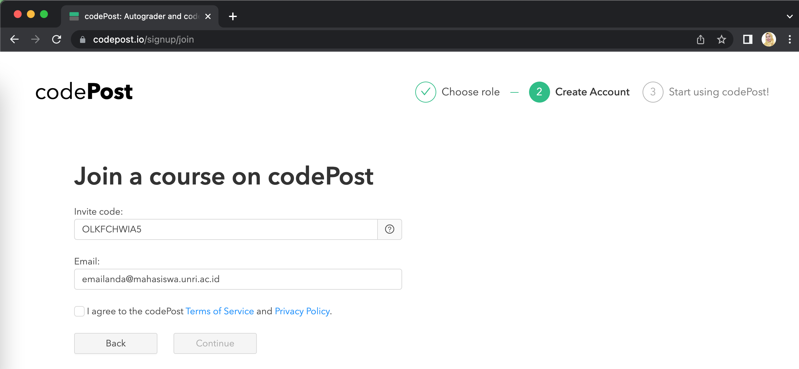

## Cara menggunakan codepost

Mendaftar codepost
1. Buka codepost dengan menggunakan URL berikut [https://codepost.io/signup/join?code=OLKFCHWIA5](https://codepost.io/signup/join?code=OLKFCHWIA5). Kode invite akan otomatis terisi seperti gambar di bawah. Isi email anda dan klik continue. 

2. Langkah berikutnya adalah codepost akan mengirim email konfirmasi ke email anda.

3. Klik link yang dikirimkan di email anda, dimana anda akan diminta mengganti password. 

4. Login ke akun anda dengan password yang baru anda masukkan, anda akan melihat daftar latihan yang bisa anda kumpulkan.      

 
 
 
 

## Mengumpulkan tugas melalui codepost
1. Login ke akun anda dan pastikan kelas yang terpilih adalah "Modul Interaktif Konsep Pemrograman".
2. Pilih tugas yang anda akan kumpulkan, klik "Upload assignment" 

3. Upload file java yang ingin anda kumpulkan dan klik "Submit/Re-submit and run tests" 

4. Klik "View Results" untuk melihat apakah tugas anda berhasil lulus semua tes yang dijalankan. Apabila ada tes yang gagal, anda dapat merevisi tugas anda dan mengumpulkan ulang dengan cara yang sama. 

